DAFTAR ISI
==========
- [LAPORAN PRAKTIKUM 6](#laporan-praktikum-6)   
    - [CODE PROGRAM DAFTAR NILAI](#code-program-daftar-nilai)
    - [FLOWCHART DAFTAR NILAI](#flowchart-daftar-nilai)
    - [KESIMPULAN](#kesimpulan)

# LAPORAN PRAKTIKUM 6

## CODE PROGRAM DAFTAR NILAI

### Step 1 : Inisialisasi Data
Tambahkan variabel data_mahasiswa sebagai list kosong yang digunakan untuk menyimpan data mahasiswa, setiap elemen dalam list adalah dictionary yang berisi informasi mahasiswa berupa Nilai Mahasiswa untuk kasus ini :

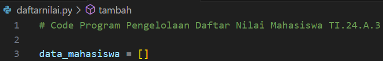

### Step 2 : Fungsi tambah()
Fungsi ini untuk menambahkan data mahasiswa baru yang akan diproses sebagai :
- Meminta pengguna memasukkan nama dan nilai mahasiswa.
- Data yang dimasukkan disimpan dalam bentuk dictionary {"nama": nama, "nilai": nilai}.
- Dictionary ini ditambahkan ke dalam list data_mahasiswa menggunakan .append().

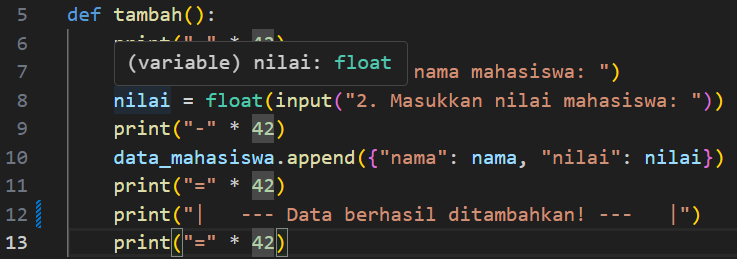

### Step 3 : Fungsi tampilkan()
Fungsi ini digunakan untuk menampilkan data nilai mahasiswa ke dalam data_mahasiswa. Tujuan dapat menampilkan seluruh data mahasiswa. Menu ini mampu mengecek apakah data_mahasiswa kosong, Jika tidak kosong data ditampilkan dalam bentuk tabel sesuai data yang telah ditambahkan, Menggunakan enumerate untuk memberikan nomor pada setiap mahasiswa dalam daftar :

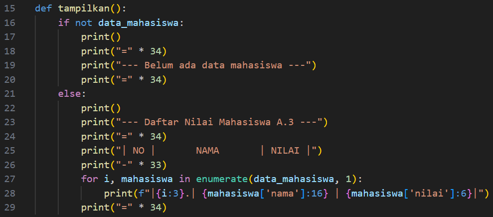

### Step 4 : Fungsi hapus(nama)
Menghapus data mahasiswa berdasarkan nama yang dimasukan/input, sebagai proses menggunakan list comprehension untuk membuat daftar baru yang tidak berisi mahasiswa dengan nama yang dimasukkan, variabel data_mahasiswa diperbarui dengan daftar baru ini :

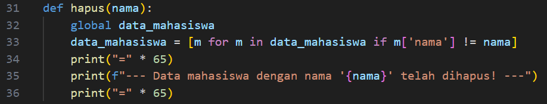

### Step 5 : Fungsi ubah(nama)
Fungsi yang akan mengubah nilai mahasiswa berdasarkan nama yang dimasukan/input, mencari data mahasiswa dengan nama tertentu di dalam data_mahasiswa. Jika data ditemukan, maka nilai mahasiswa tersebut diperbarui sesuai input pengguna :

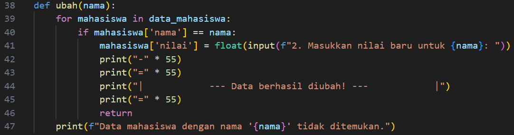

### Step 6 : Fungsi menu()
Menyediakan Tampilan menu sebagai opsi pengguna, menggunakan perulangan while untuk terus menampilkan menu namun untuk menghentikan program masukan break sebagai perhentian :

Pilihan menu:
- 1: Memanggil fungsi tambah().
- 2: Memanggil fungsi tampilkan().
- 3: Memanggil fungsi hapus(nama).
- 4: Memanggil fungsi ubah(nama).
- 5: Menghentikan program.

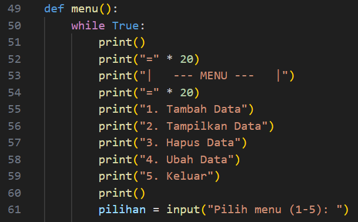

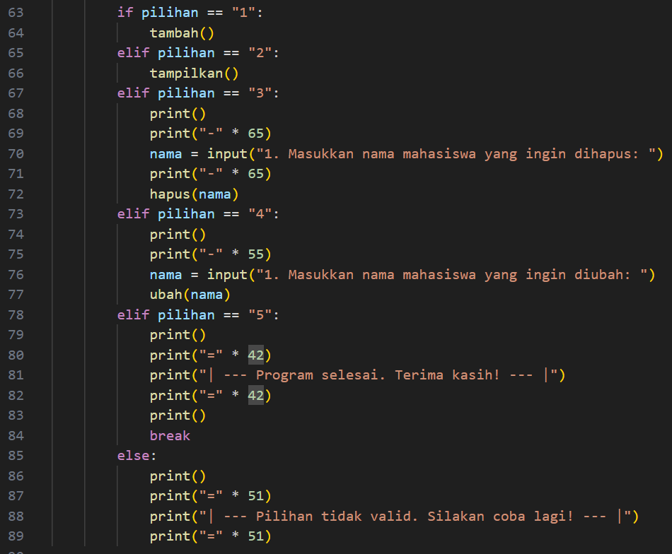

### Step 7 : Closed Program
Pakai menu() untuk memulai sebuah program ketika dirun :

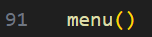

### Step 8 : Run Program
Tahap akhir adalah uji coba code program yang sudah dibuat dengan mencoba berbagai kemungkinan yang ada.

#### Case 1 :
Kondisi pertama kita akan coba melihat tabel dengan inputkan L tampa menambahkan data/masih kosong, maka akan ditampilkan isi tabel masih belum ada datanya :

#### Case 2 :
Kondisi kedua selanjutnya mencoba menambahkan data nilai mahasiswa pada tabel, dengan menginputkan T untuk menambahkan data nilai.

- Tambahkan data nilai :
    - NIM : 312410387
    - Nama : Dafa Maulana
    - Nilai Tugas : 90
    - Nilai UTS : 85
    - Nilai UAS : 79

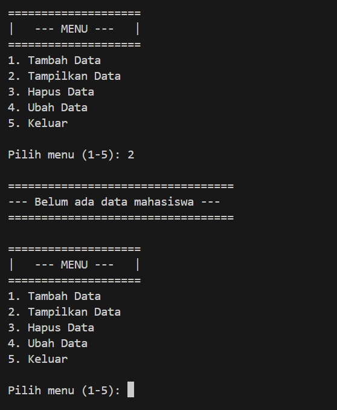

#### Case 3 :
Selanjutnya, kondisi ketiga kembali dengan menginputkan L untuk melihat daftar nilai pada tabel, dari kondisi sebelumnya yang sudah menambahkan data nilai maka akan terlihat pada isi tabel :

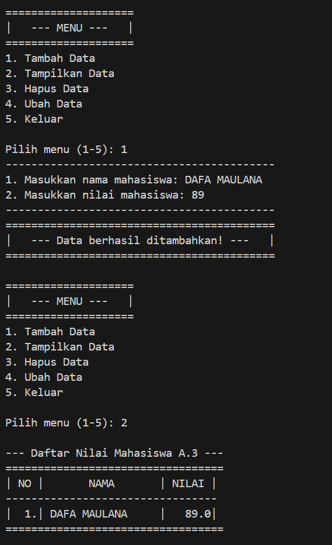

#### Case 4 :
Masuk kondisi keempat kita akan coba mengubah data, ada data yang salah diinputkan pada Nilai UTS dan Nilai UAS, Nilai UTS 85 diubah menjadi 80 dan Nilai UAS 79 diubah menjadi 89, sebelum itu inputkan U untuk mengubah maka akan ditampilkan daftar nilai tabel dan diminta untuk memasukan nomor yang ingin diubah data nilai -nya. User diminta memasukan kembali data valid yang akan diubah.

- kita coba memasukan data berikut :
    - NIM : 312410387
    - Nama : Dafa Maulana
    - Nilai Tugas : 90
    - Nilai UTS : 80
    - Nilai UAS : 89

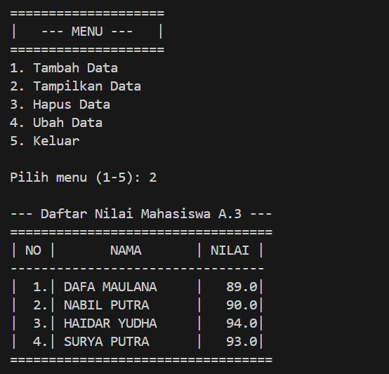

#### Case 5 : 
Lalu, kita akan coba lihat kembali pada tabel dengan menginputkan L untuk lihat apakah daftar/data nilai sudah berubah sesuai yang sudah diinputkan sebelumnya :

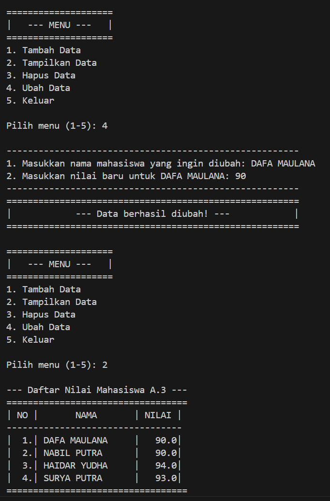

#### Case 6 :
Kondisi keenam kita ingin mencari sebuah data nilai seorang mahasiswa namun karena banyak nya data mungkin membuat kita tidak tau dimana letak nya, namun dengan menginputkan C sebagai perintah untuk mencari akan memudahkan user, setelah menginputkan C user diminta memasukan nama yang ingin dicari, setelah sudah maka akan muncul nama tersebut dalam tabel :

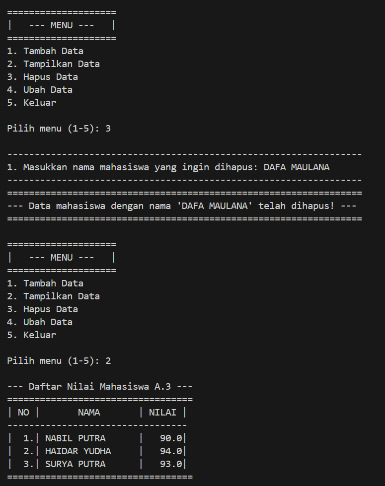

#### Case 7 : 
Kondisi ketujuh, kita mencoba menghapus sebuah data nilai mahasiswa dengan menginputkan H sebagai hapus user diminta memasukan sebuah nomor urut yang akan dihapus data nilai mahasiswa :

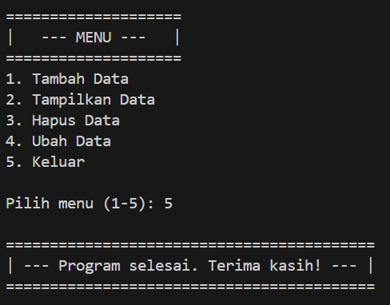

#### Case 8 :
Setelah dihapus kita akan coba lihat daftar/data nilai mahasiswa yang sudah dihapus pada tabel apakah sudah tidak ada atau masih ada, karena kita hanya menginputkan 1 data nilai saja maka output yang akan tampil adalah sebagai berikut :

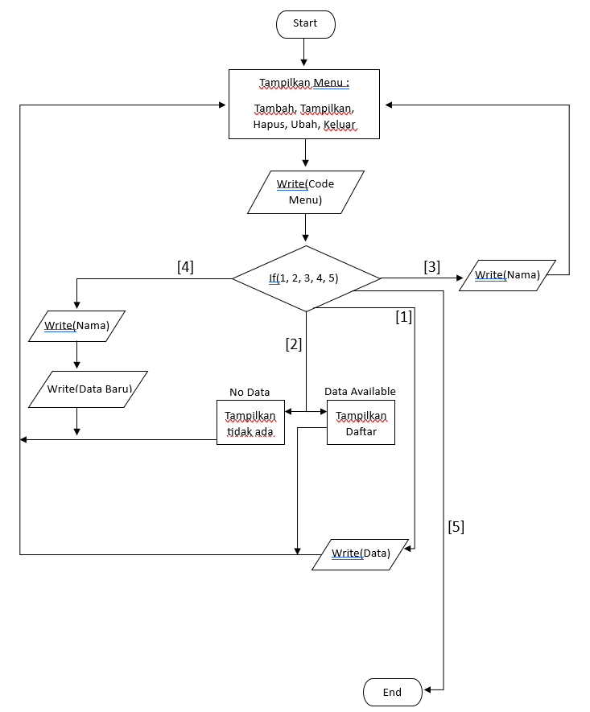

#### Case 9 :
Jika semua data atau program input sudah selesai semua, user dapat menginputkan K untuk keluar dari progam :

## FLOWCHART DAFTAR NILAI

### Step 1 :
Titik mulai sebuah program atau alur.

### Step 2 :
lalu lakukan inisialisasi dengan menampilkan menu yang tersedia.

### Step 3 :
Inputkan code menu yang ingin dilakukan, setiap code berisi [L]ihat, [T]ambah, [U]bah, [H]apus, [C]ari, [K]eluar.

### Step 4 :
Dalam kasus ini semua kemgkinan dapat terjadi, kondisi yang diperlukan sesuai apa yang akan diinoutkan user.

- Jika [L]ihat, maka user akan di tampilkan sebuah tabel dari daftar nilai, namun jika tabel belum ada isi/kosong maka akan tampil tidak ada data, jika ada maka ditampilkan sebuah data nilai mahasiswa. Setelah tampilkan data maka akan kembali menuju inisialisasi menu. 

- Jika [T]ambah, user diminta memasukan sebuah data yang berupa :
    - NIM
    - Nama
    - Nilai Tugas
    - Nilai UTS
    - Nilai UAS

Lalu User akan diarahkan kembali ke inisialiasi menu.

- Jika [U]bah, sama dengan [L]ihat jika tidak ada data nilai maka akan tampil tidak ada data nilai namun [U]bah kalau ada data nilai user diminta menginputkan Nomor urut yang akan diubah, setelah itu diminta untuk mengisi atau menginputkan data valid yang diubah. Setelah itu user kembali ke inisialisasi menu.

- Jika [C]ari, user diminta memasukan nama yang dicari, setelah itu maka akan ditampilkan tabel daftar nilai mahasiswa. Setelah itu kembali ke inisialisasi menu.

- Jika [H]apus, user akan ditampilkan daftar nilai lalu diminta memasukan sebuah nomor yang ingin dihapus dari daftar. Setelah itu kembalu ke inisialisasi menu.

- jika [K]eluar, User akan keluar program dan program akan berhenti.

## KESIMPULAN
Dengan membuat code program daftar nilai ini saya pribadi dapat mengambil pelajaran, kita mampu membuat sebuah program sederhana untuk membuatkan list yang berisikan dictionary sebagai element yang membantu pada Laporan Praktikum kali ini. Selain itu, ada nya flowchart yang dibuat dengan banyak nya perulangan tapi tetap dengan konsep harus ada perhentian, karena sebuah program harus memiliki sebuah titik berhenti.